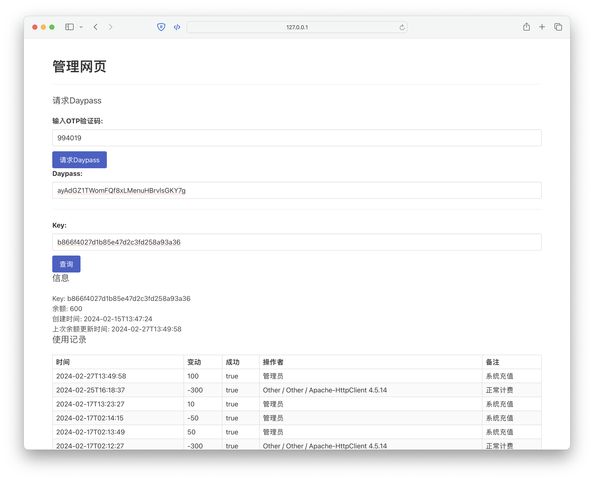

# Hablar: GPT powered Translator

This is a translation software backend based on FastAPI, which calls OpenAI's API and Azure's SpeechServices to implement translation and voice functions. The main features include billing, recharge, historical conversation records, and other commercial features.

这是一个基于FastAPI的翻译软件后端，调用OpenAI的API和Azure的SpeechServices实现翻译和语音功能。主要特性包括计费、充值、历史对话记录等商业化功能。

## Main Features
## 主要特性

- **No user account needed**: No user account feature is set, each key is an account, all information (balance, records) conform the given key, which is convenient for SaaS ‘faka’ sites to use.

- **Complete billing system**: Includes recharge and consumption record functions. Customized billing rate is supported.

- **Historical conversation records**: You can view historical translation records.

- **Database**: MySQL is used as the backend database.

- **Management page**: A simple management page is provided, and strong authentication is required (mandatory mobile authorization code valid for 24 hours + 2FA before each operation).

- **无用户账户功能**：不设用户账户功能，每个key就是账户，所有信息（余额、记录）跟着给定的key走，这样便于发卡站点使用。

- **完善的计费系统**：包括充值和消费记录功能。支持自定义倍率。

- **历史对话记录**：可以查看历史翻译记录。

- **数据库**：使用MySQL作为后端数据库。

- **管理页面**：提供了一个简单的管理页面，并且要求强认证（强制手机授权码24小时有效+每次操作前2FA）。

## More Information
## 更多信息

The front end is developed using Flutter and supports all platforms. It will be open sourced in my repository after completing the basic functions.

前端使用flutter开发，支持全平台。在完成基本功能后将在仓库开源。

## How to Start

## 如何开始
1. Clone this repository
2. Install dependencies
3. Set your OpenAI and Azure API keys (fill in the relevant information in the `general_template.yaml` template in the `./config` directory and rename it to `general.yaml`)
4. Run the application

1. 克隆这个仓库
2. 安装依赖
3. 设置你的OpenAI和Azure的API keys（在`./config`目录中的`general_template.yaml`模板中填写相关信息，并重命名为`general.yaml`）
4. 运行应用

## Contribution

## 贡献

Any form of contribution is welcome, including reporting issues, proposing new features, or submitting code.
欢迎任何形式的贡献，包括报告问题，提出新功能，或者提交代码。

## License
## 许可证

This project follows the Creative Commons license. For details, please check [LICENSE](./LICENSE).

此项目遵循Creative Commons许可证。详情请查看[LICENSE](./LICENSE)。
## Contact

## 联系
If you have any questions or suggestions, please feel free to contact me in the following ways:

- Submit a GitHub issue
- Send an email to: weiruik@outlook.com

如果有任何问题或者建议，欢迎通过以下方式联系我：
- 提交一个GitHub issue
- 发送邮件到: weiruik@outlook.com
Looking forward to your feedback!

期待你的反馈！
